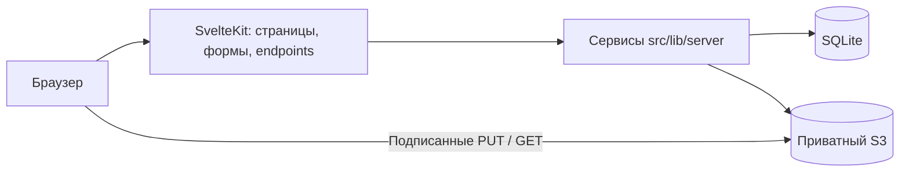

# Архитектура Viewport

Viewport — сервис передачи фотографий от фотографа клиенту. Один Node.js процесс обслуживает страницы, формы, HTTP endpoints, SQLite и приватное S3-хранилище.

```mermaid
flowchart LR
  B[Браузер] --> K[SvelteKit: страницы, формы, endpoints]
  K --> A[Сервисы src/lib/server]
  A --> DB[(SQLite)]
  A --> S3[(Приватный S3)]
  B -->|Подписанные PUT / GET| S3
```

## Модули

| Расположение               | Ответственность                                                         |
| -------------------------- | ----------------------------------------------------------------------- |
| `src/routes`               | Страницы, load, server actions и HTTP endpoints                         |
| `src/lib/components`       | Компоненты интерфейса                                                   |
| `src/lib/server/auth`      | Better Auth, cookie-сессии и requireUser                                |
| `src/lib/server/db`        | Drizzle schema, SQLite и атомарные транзакции                           |
| `src/lib/server/galleries` | Владение, настройки, обложка, порядок, публикация и доступ к оригиналам |
| `src/lib/server/photos`    | Квота, резервирование, confirm, Sharp и очистка                         |
| `src/lib/server/storage`   | AWS SDK, операции S3 и подпись URL                                      |

Routes вызывают серверные сервисы. Для редактирования используются server actions; отдельный REST CRUD API не вводится. Серверные модули не импортируются в клиентский код.

## Данные

SQLite работает с WAL, включёнными внешними ключами и busy timeout. Схема находится в `src/lib/server/db/schema.ts`, SQL и metadata миграций — в `drizzle/`. Миграции применяются до запуска HTTP-сервера.

- `users`, `sessions`, `accounts`, `verifications` — таблицы Better Auth.
- `galleries` — владелец, название, описание, тема, статус `draft | published`, признак незавершённого удаления, обложка и уникальный nullable token.
- `photos` — статус `pending | processing | ready | failed`, имя, MIME, размер оригинала, ключи временного объекта/оригинала/превью, размер превью, его width/height и позиция.
- `upload_reservations` — размер, срок, статус `reserved | completed | released | expired` и отметка успешной очистки `cleanedAt`.
- `deleted_uploads` — ключи временных объектов удалённых галерей и время последней попытки их повторной очистки.

Даты хранятся в UTC с точностью до миллисекунд, размеры — целыми байтами. CHECK constraints ограничивают значения и запрещают ready без метаданных превью. Обложка проверяется сервисом: это ready photo той же галереи. Внешние ключи для объектов S3 не используют каскадное удаление.

## Авторизация и владение

Better Auth использует Drizzle adapter и cookie-сессии. Hook заполняет locals; каждый защищённый load/action/endpoint повторяет проверку сессии и владельца. Чужой ресурс возвращает 404. Изменение настроек и состава разрешено только в draft.

Регистрация через HTML и `/api/auth/sign-up/email` требует `REGISTRATION_INVITE_CODE`. Before hook сравнивает код на сервере; без настроенного кода регистрация закрыта. Код не записывается в пользователя и не возвращается в page data. Форма вызывает тот же HTTP handler Better Auth, что и API: стандартный лимит входа/регистрации — три запроса за десять секунд на IP и auth path, общий для HTML/API. IP берётся из `getClientAddress()` и передаётся во внутреннем заголовке, который сервер всегда перезаписывает. Лимитер хранится в памяти единственного процесса и сбрасывается при рестарте.

`ORIGIN` задаёт `paths.origin` при сборке и baseURL Better Auth при запуске. При смене origin требуется пересборка. CSRF-проверки включены. Политика referrer — `same-origin`: обычные HTML-формы сохраняют Origin, а внешние S3-запросы не получают referrer.

## Загрузка и обработка

1. Владелец draft отправляет метаданные файлов.
2. В `BEGIN IMMEDIATE` сервер проверяет доступ, статус и лимиты. Квота считается как ready original bytes + reserved bytes; pending photos и reservations создаются атомарно.
3. После commit сервер выдаёт PUT URL для временных ключей `users/{userId}/galleries/{galleryId}/uploads/{photoId}`. SigV4 подписывает `Content-Length` с зарезервированным размером и `Content-Type`; S3 отклоняет другой размер или MIME-заголовок. Сбой подписи переводит фотографии в failed и освобождает резервы.
4. Браузер загружает файлы напрямую в S3. Загрузчик ограничивает число одновременных передач и показывает прогресс.
5. Confirm проверяет владельца, draft, срок резерва, HEAD и фактический размер GET. Атомарный переход в processing исключает повторную обработку одного фото.
6. Sharp распознаёт содержимое JPEG/PNG/WebP, ограничивает пиксели, учитывает EXIF-ориентацию и создаёт WebP-превью без приватных метаданных. Обработка ограничена числом активных операций; при перегрузке сервер возвращает 429, без фоновой очереди.
7. Сервер сохраняет неизменённый оригинал в `originals/{photoId}`, а превью — в `previews/{photoId}.webp`. Браузерный PUT не имеет доступа к принятым оригиналам, поэтому повтор временной ссылки не перезаписывает их.
8. Короткая транзакция повторно проверяет draft, processing и резерв, записывает ready и completed. Первая фотография становится обложкой. Повтор confirm для ready не создаёт новую обработку и не удваивает квоту.

Сетевые операции выполняются вне SQLite-транзакций. Размер PUT связан с подписью: браузер сам выставляет `Content-Length` по размеру File, приложение не пытается устанавливать этот запрещённый для JS заголовок. При confirm дополнительно проверяются фактический размер и содержимое. По умолчанию допускаются файлы до 10 МиБ, квота оригиналов — 5 ГиБ. Временные объекты и превью увеличивают фактический расход S3 сверх квоты оригиналов.

## Ошибки и очистка

При ошибке или отмене photo переходит в failed, резерв — в released. Повтор такой загрузки создаёт новый photo. Ключи сохраняются до очистки, поскольку старый PUT URL может ещё действовать.

Очистка выбирает истёкшие reservations порциями: удаляет временные объекты, а для неготовых фото — также оригинал и превью. `cleanedAt` записывается после успешного удаления. При отказе S3 запись остаётся доступной для повтора. Зависший после рестарта processing очищается по TTL.

Очистка запускается перед presign и отдельной CLI. Внутри приложения она пропускает активные confirm; CLI запускается при остановленном приложении. Команды — в [deployment.md](deployment.md).

## Удаление галереи

Владелец подтверждает удаление черновика в редакторе. Опубликованную галерею и галерею с обрабатываемыми снимками удалить нельзя. Для всех её загрузок ожидается истечение срока резерва (по умолчанию 30 минут). При удалении истёкший `processing` восстанавливается, если в текущем процессе обработка уже не выполняется; действительно работающую обработку удалить нельзя.

Короткая транзакция устанавливает устойчивый признак удаления и блокирует дальнейшие изменения, загрузки и публикацию. Затем вне транзакции удаляются временные объекты, оригиналы и превью. При ошибке S3 галерея и все ключи остаются в БД, а пользователь может повторить удаление. После успешного удаления объектов другая транзакция сохраняет ключи временных загрузок в `deleted_uploads` и удаляет резервы, снимки и галерею. PUT, начатый до истечения ссылки, может завершиться после удаления: ключи сохраняются бессрочно и повторно проверяются порциями в фоновом проходе после подготовки загрузки и при запуске CLI. В приложении одновременно выполняется не более одного такого прохода; подготовка новых загрузок его не ожидает. При отказе S3 ключ также остаётся для следующей попытки. При отсутствии загрузок для удаления поздних объектов требуется периодический запуск `uploads:cleanup`; сам по себе таймер в приложении не работает. Повторные DELETE S3 безопасны; незавершённое удаление видно в кабинете.

## Публикация и скачивание

Публикация атомарно проверяет наличие ready photos, корректную обложку и отсутствие reserved uploads. Токен генерируется через `randomBytes(32).toString('base64url')`; уникальность защищена SQLite. Published блокирует редактирование. Unpublish переводит галерею обратно в draft.

`/g/{token}` доступен без регистрации и показывает только published gallery с ready photos. Неизвестный токен и снятая публикация дают 404. Публичные page data не содержат email владельца и внутренних ключей объектов.

Выбор посетителя светлой или тёмной темы хранится в cookie и учитывается при серверном рендеринге; без выбора используется тема фотографа. В открытой вкладке JavaScript обновляет ссылки на превью через `/g/{token}/previews` после 90 секунд или ошибки загрузки. Маршрут повторно проверяет публикацию и выдаёт только ID и подписанные URL готовых снимков. При сетевом сбое предлагается повтор, а после снятия публикации показывается сообщение о недоступности галереи. Без JavaScript новые ссылки выдаются при обновлении страницы.

`/api/downloads/{token}/{photoId}` при каждом запросе проверяет token, published, ready и принадлежность фото, затем перенаправляет на GET URL оригинала с безопасным Content-Disposition. Срок подписанного GET — 120 секунд. Unpublish закрывает новые запросы, но не отзывает уже выданные S3 URL до истечения TTL. Страницы и ответы с подписанными ссылками не кэшируются публично.

Владелец скачивает оригинал через `/api/galleries/{id}/photos/{photoId}/download`: маршрут проверяет сессию, владение галереей и принадлежность готовой фотографии, затем выдаёт подписанный GET с тем же сроком и именем файла. Маршрут работает для черновиков и опубликованных галерей; при незавершённом удалении выдача новых ссылок запрещена. Подписанный URL действует напрямую до истечения TTL.

## Развёртывание

Compose запускает приложение и SeaweedFS с отдельными SQLite/S3 volumes. Внутренний `S3_ENDPOINT` используется для серверных операций, `S3_PUBLIC_ENDPOINT` — для подписи браузерных ссылок. Приложение работает пользователем node; перед стартом выполняются миграции и настройка bucket/CORS. `/health` проверяет доступность таблиц SQLite.

Инструкции запуска — в [deployment.md](deployment.md), команды проверок — в [verification.md](verification.md), план дальнейших изменений — в [backlog](../tasks/README.md).
